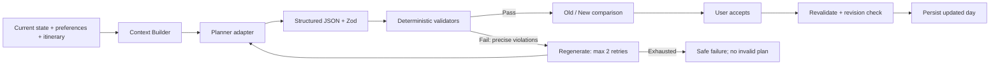

# Dayshift · Dynamic Travel Replanning Agent

**动态旅行重规划智能体**。一个移动端优先的 AI 产品经理作品集 MVP：当天的计划遇到下雨、晚点、疲劳或地点关闭时，只重规划接下来半天／一天，同时保留预约等硬约束。

## Quick start

需要 Node.js 22.13+（推荐 Node 24）和 npm。

```sh
npm ci
npm run dev:next
# http://localhost:3000
```

无需账号或 API Key：点击 **Try Bangkok Demo → My plans changed → Replan my day → Accept plan**。

这是明确标识的 **模拟规划模式**，不调用大模型，不声称具有模型推理能力。默认曼谷场景为 2026-09-10 15:00、Siam、下雨、低体力。已完成大皇宫和午餐，错过 Wat Arun，原计划 17:00 ICONSIAM，19:00–20:30 晚餐锁定。

### 开启真实 OpenAI 规划

复制 `.env.example` 为 `.env.local`，设置：

```dotenv
OPENAI_API_KEY=your-server-side-key
OPENAI_MODEL=gpt-5.6-sol
NEXT_PUBLIC_SUPABASE_URL=https://your-project.supabase.co
NEXT_PUBLIC_SUPABASE_ANON_KEY=your-public-anon-or-publishable-key
```

模型名称仅由环境变量控制。`gpt-5.6-sol` 是文档确认支持 Structured Outputs 的示例，可改为账号有权限使用的其他兼容模型。所有 OpenAI 调用发生在服务端，通过 Responses API 的 `responses.parse` 和 `zodTextFormat` 返回结构化数据。禁止将 API Key 加上 `NEXT_PUBLIC_` 前缀。

Supabase 配置步骤见下节。重启后，变化输入页的 Planning mode 可选择 **Live · OpenAI planner**。仅限本地调试时，可不配置 Supabase，设置 `ALLOW_LOCAL_LIVE=true`；生产环境不允许该绕过。

真实模型与远程数据库需要你自己的凭据。交付时完成的是代码集成与模拟验证，**未使用真实密钥运行 LLM 或执行远程数据库迁移**。

## Problem

静态旅行计划假设时间、天气和体力保持不变。旅行中的一次晚点或突发降雨，会让后续多个活动不再可行。旅行者真正的负担不是寻找更多攻略，而是在地图、预约、预算和个人偏好之间重新做一组局部决策。

## Product hypothesis

如果用户能快速报告当前状态，并看到一个保留关键预约、解释改动原因、可直接接受的新方案，就能减少重新规划的认知负担。第一版验证的是 **State → Disruption → Replan → Compare → Accept** 的完整闭环。计划接受率是产品假设的反馈信号，不代表真实旅行满意度。

## Product flow

- `/`：产品入口和 Bangkok Demo。
- `/onboarding`：城市、日期、每日预算、节奏、兴趣、厌恶与步行接受度。
- `/trip`：当前状态、已完成与未完成行程、锁定事件、主要 CTA。
- `/replan`：七种变化原因、自由文本、时间、位置、体力、天气、预算、关闭地点。
- `/result`：Old vs New、逐项解释、约束结果、接受、重新生成、偏好调整、显式记忆。
- `/evals`：真实运行生成的模拟评测报告与当前浏览器的交互统计。

接受方案先再次运行服务端校验，再保存今天的行程。已完成记录不被替换。跨日建议不自动插入未来日程。偏好改变会废弃尚未接受的旧结果。保存时进行 revision 比较，防止另一个标签页的旧方案覆盖新状态。

## AI architecture



`agents/context-builder.ts` 将 UserProfile、Trip、TripState、现有行程、剩余事件、锁定事件、变化、26 个地点和交通矩阵整理为 JSON Context。不会读取或发送无关数据库字段。

`services/openai.ts` 定义 Planner 接口及 OpenAI 实现。`agents/demo-planner.ts` 是同接口的确定性模拟器；基于状态与偏好打分并筛选可行活动，不使用模型，也不理解自由文本。

`agents/replanning-agent.ts` 负责生成、解析、校验、反馈重试和返回审计记录。首次生成 + 最多 2 次重试；OpenAI SDK 自身重试被关闭，单次超时 25 秒，避免叠加造成无限等待。拒答、截断、非结构化输出、API 错误和最终校验失败都返回友好状态。

### Why LLM

低体力时取消哪个活动、下雨时保留哪些体验、如何兼顾咖啡偏好与少改行程，存在情境性的软取舍。大模型适合解释这些取舍，而固定规则很难覆盖自然语言表达。真实模式使用完整用户偏好、记忆和变化文本；手动状态字段是时间和天气等事实的来源。

### Why deterministic validators

锁定预约、时间和预算属于确定性规则，不能只依赖概率模型遵守 Prompt。即便输出格式正确，也不保证内容可行。

实际校验包括：

1. **Locked event**：保留原 ID、地点、名称、地点区域、价格、开始／结束时间和锁定状态。
2. **Time conflict**：按时间比较活动，拒绝任意重叠。
3. **Travel time**：检查从当前地点出发及活动间交通时间；使用服务端目录和矩阵，不相信模型填写的交通时间。
4. **Opening hours / closure**：按地点目录营业时间和手动上报关闭列表校验，不允许模型伪造营业时间。
5. **Budget**：剩余活动总额不超过剩余预算，同时校验价格与目录一致。
6. **Past event**：未来候选不能开始于当前时间以前；已完成历史不能混入候选。
7. **Duration**：结束时间严格晚于开始时间。
8. **Identity / accounting**：拒绝未知地点、重复 ID、篡改元数据、静默遗漏旧活动和未经用户授权新增锁定。

只有校验通过的计划才提供 Accept。无解时最多三次尝试后保留原行程并要求调整约束。即使某个锁定地点关闭，也不会自动删除预约。

## Project structure

```text
app/                 Next.js App Router pages + API routes
components/          Travel UI, workflows, eval dashboard, bundled UI primitives
lib/time.ts          Time conversion helpers
services/            OpenAI adapter, places, browser storage, server authentication
agents/              Context, prompts, demo planner, bounded replanning loop
validators/          Modular hard constraints and combined validation
 types/index.ts      TypeScript types and Zod contracts
 data/               26 Bangkok places, original itinerary, generated eval report
 evals/              32 synthetic cases, runner, adversarial validator tests
 supabase/migrations/ Postgres schema, RLS, atomic save, usage limit
 scripts/            Evaluation runner and HTTP smoke checks
 outputs/            User-facing evaluation JSON and packaged deliverables
```

No LangChain, LangGraph, vector store or agent framework is required.

## Supabase persistence and authentication

1. 新建 Supabase 项目。
2. 在 SQL Editor 执行 `supabase/migrations/001_travel.sql`。
3. 在 Auth 设置开启 **Anonymous Sign-Ins**。
4. 设置公开项目 URL 和 anon/publishable key。不要把 service-role key 放入浏览器；本实现不需要 service-role key。
5. 在生产站点配置同名环境变量并重新部署。

匿名会话无需访客输入邮箱，数据库通过 `auth.uid()` 的 Row Level Security 隔离不同访客。资料、旅行状态、行程和显式记忆存为 `travel_snapshots.snapshot`，通过事务函数保存并比较 revision。Analytics 写入 `travel_analytics`。实时规划端点验证用户 token，使用独立数据库计数器限制每访客每分钟 5 次请求。

未配置 Supabase 时使用 LocalStorage 演示。配置后云端读取／保存失败会展示错误，保存失败不会假装成功。浏览器分析事件有本地副本；分析写入失败不阻塞规划。匿名身份绑定当前浏览器，清除浏览数据或换设备无法恢复，不承诺跨设备账号同步。

生产公开使用还需在 Supabase 开启机器人防护并设置 OpenAI 项目费用限额；每访客限流不替代全站成本控制。当前部署面向私有作品集演示。

## Evaluation

```sh
npm test
npm run evals
# Requires real key and model access; incurs API usage:
npm run evals -- --live
```

`npm test` 覆盖 25 项规则／循环检查，包括伪造价格、伪造营业时间、删除和修改锁定、跨活动交通不足、零时长、重复 ID、无效结构、API 抛错、修复成功及最大重试次数。

32 个合成场景分别具有 UserProfile、TripState、现有行程、disruption 和期望约束。包含 27 个有解场景与 5 个故意无解场景：预算不足、已错过锁定、无法及时到达、锁定地点关闭、两个锁定冲突。Runner 调用真实 Agent Loop，再独立执行一次最终校验。

模拟基线：

- Scenario expected outcome rate：32/32 = **100%**。
- Feasible case valid-plan rate：27/27 = **100%**。
- Hard Constraint Pass Rate（有效计划 / 所有案例）：27/32 = **84.375%**。
- 五个无解案例均拒绝；无效计划不会应用。
- 每次尝试的 locked/time/closing/budget/travel 等违规率另行输出，不隐藏失败候选。

这些数字属于 **确定性模拟基线**，不是 LLM 质量或真实用户指标。CLI 输出和 `outputs/eval-demo.json` 可复查；`data/eval-report.json` 是仪表盘展示的已运行快照，不是在页面打开时偷偷调用模型。

模型对比：设置 `EVAL_MODELS=model-a,model-b` 后运行 live eval，每个模型使用同一套案例和验证器，并单独输出 JSON。也记录耗时和重试次数。`SoftEvaluationSchema` 预留人工 1–5 分：Relevance、Personalization、Reasonableness、Preference Alignment、Explanation Quality；本版不实现 LLM-as-a-Judge。

### Analytics definitions

记录：trip_created、replan_started、replan_generated、replan_validation_failed、replan_regenerated、replan_accepted、replan_rejected、preference_saved。

- Plan Acceptance Rate = 唯一 accepted plan IDs / 唯一 valid generated plan IDs。
- Average Regeneration Count = generated 事件 regenerationCount 平均值；评测报告另统计全部案例。
- Attempt Hard Constraint Pass Rate = 有效生成次数 /（有效生成次数 + 失败候选次数）。

接受和拒绝按 plan ID 去重。事件属性不包含原始自由文本。演示与真实规划有 mode 字段，应分开分析。浏览器发送的产品事件不是防篡改的财务审计，也不把作品集模拟流量当成真实用户验证。

## Deployment

### Vercel (native Next.js)

```sh
npm run build:vercel
npm run start:next
```

将代码推送到自己的 Git 仓库后导入 Vercel。仓库提供 `vercel.json`：框架 Next.js，Build Command `npm run build:vercel`，Output `.next`。无环境变量可运行完整模拟闭环；配置 OpenAI 和 Supabase 后开启真实模式。设定支持 90 秒的服务端函数执行时间／套餐。

### Sites (this environment)

本工作区同时保留 Sites 的 Vinext 构建适配层，复用同一套 Next.js App Router 源码。`npm run build` 用于 Cloudflare Workers / Sites 输出，`npm run dev` 用于 Sites 预览；Vercel 使用上面的 native Next.js 脚本。两种目标不混用构建产物。Sites 运行时环境变量需在站点环境中设置，不能把密钥写入 `.openai/hosting.json`。

## Assumptions and limitations

- MVP 仅曼谷，时间为目的地当地 24 小时制；不支持跨午夜活动、时区换算或自动推进旅行时钟。
- 全部地点的价格、营业时间和经纬度是作品演示数据，不是实时营业信息；不含每周休息日与节假日。
- 不同地点同区域交通估算 15 分钟，相邻区域 30 分钟，其他区域 45 分钟；同一地点为 0。当前只记录区域，因此首次出发也保守预留交通。
- 预算涵盖地点活动估算费用；交通时间只代表时长，不报价交通费。完成活动的价格用于初始化已花费预算；用户可手动修正剩余预算。
- 全部候选引用已知地点；无法凭空推荐用户自由文本中的新店。Live 可解释／选择目录内替代项，Demo 使用结构化选择，不解析自然语言。
- 未来移动是明确标注的建议，不验证未来整天交通／冲突，也不会自动确认。
- 模拟器用于展示闭环，不模拟一般性的语言理解。真实模型输出仍需硬校验。
- 无法撤销已完成事件；接受方案不会扣减尚未发生的费用。
- 对称区域交通、当天时间模型和显式记忆为可替换服务边界。

## MVP scope

刻意不做 booking、完整旅行生成、酒店／机票购买、地图集成、语言学习、社交、RAG、embedding、多智能体或隐式长期记忆。新增功能应直接帮助用户在变化后重规划今天剩余的行程。

## Future work

可扩展真实天气、地点搜索、地图交通、持续偏好学习、多城市／多国家、真正的跨日行程校验，并用真实用户样本验证节省时间和计划接受率。

## Sources and image credit

- [OpenAI Structured Outputs](https://developers.openai.com/api/docs/guides/structured-outputs)
- [GPT-5.6 Sol model capabilities](https://developers.openai.com/api/docs/models/gpt-5.6-sol)
- [Supabase anonymous authentication](https://supabase.com/docs/guides/auth/auth-anonymous)
- [Supabase Row Level Security](https://supabase.com/docs/guides/database/postgres/row-level-security)
- Hero image: AI-generated Bangkok-inspired riverfront illustration. Explicitly labelled as an imagined scene, not a documentary landmark photograph.
